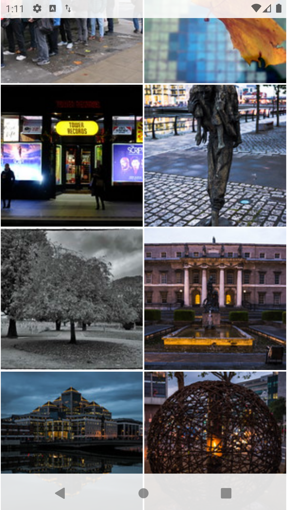

# Flickr Search
Android App to search for and display images from Flickr, tapping on an image shows expanded view

## Getting Started
The app and tests can be built and run using Android Studio

## The App
There's a single activity - [MainActivty](app/src/main/java/com/marklynch/flickrsearch/MainActivity.java)

A single single Fragment responsible for dislaying images - [ImagesFragment.java](app/src/main/java/com/marklynch/flickrsearch/ui/main/ImagesFragment.java)

A package for interactions with the Flickr Server - [io/flickr](app/src/main/java/com/marklynch/flickrsearch/io/flickr)

A View Model for linking the back and front ends of the app - [MainViewModel.java](app/src/main/java/com/marklynch/flickrsearch/ui/main/MainViewModel.java)

## Tests
Unit tests can be found ing app/src/test and Android instrumentation tests can be found in app/src/androidTest

The app has been tested on Pixel emulators using SDK 29 and 22, and on a physical S8+ running SDK 28

## Libraries used
**Lifecycle Livedata** for updating ui, **Retrofit** for REST calls, **Jackson** for handling JSON, **Timber** for logging, **Chuck** for monitoring http traffic in debug, **Glide** for downloading, caching and displaying images, **JUnit** for unit tests, **Espresso** for Android intrumentation tests, **OKHttp Moch Server** for testing REST interface

#### Gallery with Search Bar Visible

#### Gallery with Search Bar Hidden

#### Expanded Image

#### Expanded Image

